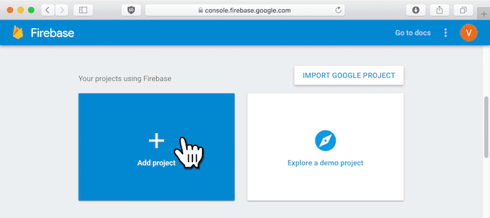
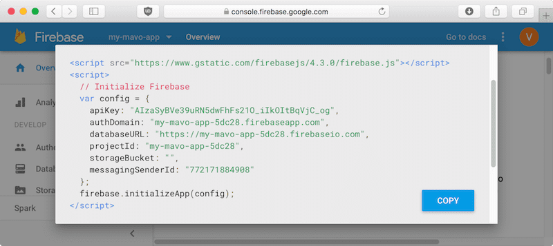

# Mavo-firebase

A Firebase backend plugin for [Mavo](https://mavo.io).

## Examples

[To-Do List](https://valterkraemer.github.io/mavo-firebase/examples/todo/)

## Setup mavo-firebase

Add Firebase and initialize it in the `<head>` of your HTML file.

    <script src="https://www.gstatic.com/firebasejs/4.3.0/firebase.js"></script>
    <script src="path/to/mavo-firebase.js"></script>
    <script>
      firebase.initializeApp({
        apiKey: '...',
        authDomain: '...',
        databaseURL: '...',
        projectId: '...',
        storageBucket: '...',
        messagingSenderId: '...'
      });
    </script>

Check out the [Setup Firebase](#setup-firebase) section to find out how to set up a Firebase database.

## Attributes

| Attribute                            | Default                              | Description                             |
|:------------------------------------ |:------------------------------------ |:--------------------------------------- |
| `firebase-default-permissions`       | `"read login"`                       | Permissions for an unauthenticated user |
| `firebase-authenticated-permissions` | `"read edit add delete save logout"` | Permission for an authenticated user    |

E.g.
```
<main mv-app="todo"
  mv-storage="firebase"
  firebase-default-permissions="read edit save">

  ...
```

## Setup Firebase

Login or signup at https://console.firebase.google.com

### Create a new project




### Get your project's config details

Insert these values into the `firebase.initializeApp` in your app.




### Setup database rules

To be able to read and write to the database we will make it public.


Set `.read` and `.write` to `true`. Remember to click "Publish".

**Warning:** After this step anyone can read and write to your database.


