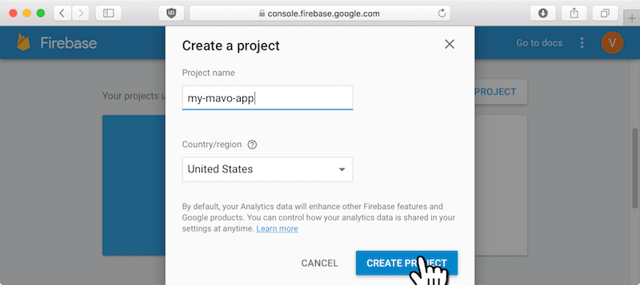
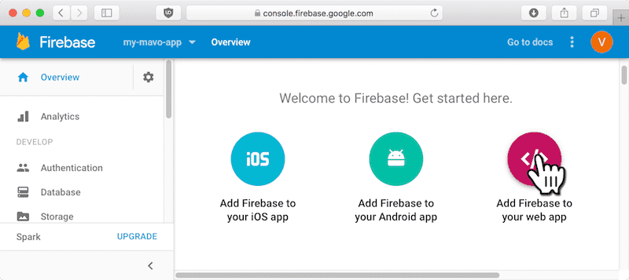
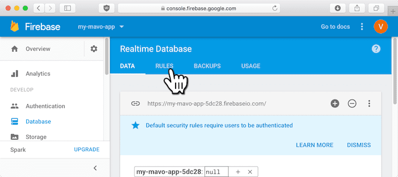
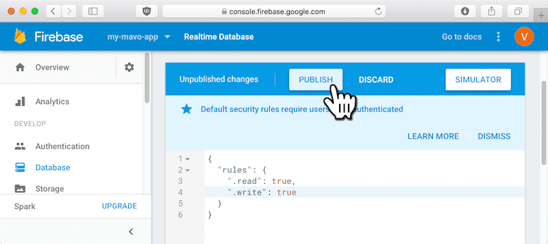

# Mavo-firebase

A Firebase backend plugin for [Mavo](https://mavo.io).

Mavo-firebase is made to work with [mavo-offline-interceptor](https://github.com/valterkraemer/mavo-offline-interceptor) that enables changes to be pushed from the server and offline support.

**Note**: Does not work well with Mavo 0.1.4 nor earlier. You may need to use the dev version of Mavo.

## Examples

- [To-do list](https://github.com/valterkraemer/mavo-firebase/tree/master/examples/todo) - ([DEMO](https://valterkraemer.github.io/mavo-firebase/examples/todo/))
- [High score (Authentication)](https://github.com/valterkraemer/mavo-firebase/tree/master/examples/authentication) - ([DEMO](https://valterkraemer.github.io/mavo-firebase/examples/authentication/))
- [Image and video of the day (File upload)](https://github.com/valterkraemer/mavo-firebase/tree/master/examples/file-storage) - ([DEMO](https://valterkraemer.github.io/mavo-firebase/examples/file-storage/))

## Quick setup

1. Get the newest version of mavo-firebase from the [release section](https://github.com/valterkraemer/mavo-firebase/releases).
2. Add Firebase and mavo-firebase to the `<head>` of your HTML file.

```
<script src="https://www.gstatic.com/firebasejs/4.4.0/firebase.js"></script>
<script src="path/to/mavo-firebase.js"></script>
```

**Tip:** *Check out the [Setup Firebase](#setup-firebase) section to find out how to set up a Firebase database.*

3. Set `mv-storage` to your Firebase database url, `mv-firebase-api-key` to your api-key and `mv-unauthenticated-permissions="read edit save"` if you want unauthenticated users to be able to edit and save.

```
<main mv-app="todo"
  mv-storage="https://databaseName.firebaseio.com"
  mv-firebase-api-key="apiKey"
  mv-unauthenticated-permissions="read edit save">

  ...
```

## Attributes

| Attribute                        | Description                             | Example                               |
|:---------------------------------|:--------------------------------------- |:------------------------------------- |
| `mv-storage`                     | Database url (required)                 | `https://databaseName.firebaseio.com` |
| `mv-firebase-api-key`            | Api-key (required)                      | `AdsfgDGFf-asdfGFDdfsdf5A-4ASFDgfhdf` |
| `mv-firebase-auth-domain`        | Auth domain to enable login             | `projectId.firebaseapp.com`           |
| `mv-firebase-storage-bucket`     | Storage bucket to enable file uploading | `bucket.appspot.com`                  |
| `mv-server-push`                 | Push data from server on changes        |                                       |

#### Permission attributes

| Attribute                        | Default                                                     | Description                           |
|:-------------------------------- |:----------------------------------------------------------- |:------------------------------------- |
| `mv-unauthenticated-permissions` | `read`, also `login` if `firebase-auth-domain` is specified | Permissions for unauthenticated users |
| `mv-authenticated-permissions`   | `read edit add delete save logout`                          | Permissions for authenticated users   |

Your Mavo id will be used as name for the root object in database.

## Setup Firebase

Login or signup at https://console.firebase.google.com

### Create a new project




### Get your project's config details

Set the [attributes](#attributes) to the values from the config.




### Setup database rules

We will make the database public so that we can read and write to it.




Set `.read` and `.write` to `true`. Remember to click "Publish".

**Warning:** After this step anyone can read and write to your database.


